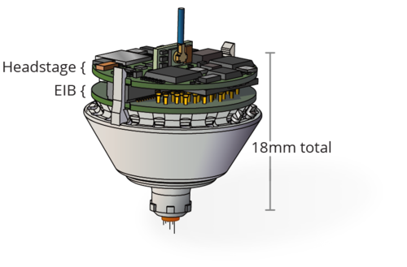

# shuttle-drive

Next gen. tetrode drive implant 

Despite continuous improvements of new silicon based electrode technologies and methods for population imaging, tetrode arrays maintain an advantage for neural recordings in many studies with behaving animals, especially for deep structures and chronic recordings. Here we outline an improved drive design for use in freely behaving animals that makes use of recently developed technologies to reduce the complexity and build time of the drive while maintaining a low weight. The design also presents an
improvement over many existing designs in terms of robustness and ease of use. We describe two variants: a 16 tetrode implant weighing ∼2 g for mice, bats, and similar animals, and a 64 tetrode implant weighing ∼16 g for rats, tree shrews, and similar animals.These designs were co-developed and optimized alongside a new class of drive-mounted feature-rich amplifier boards with ultra-thin RF tethers, as described in an upcoming paper (Newman, Zhang et al., in prep).

